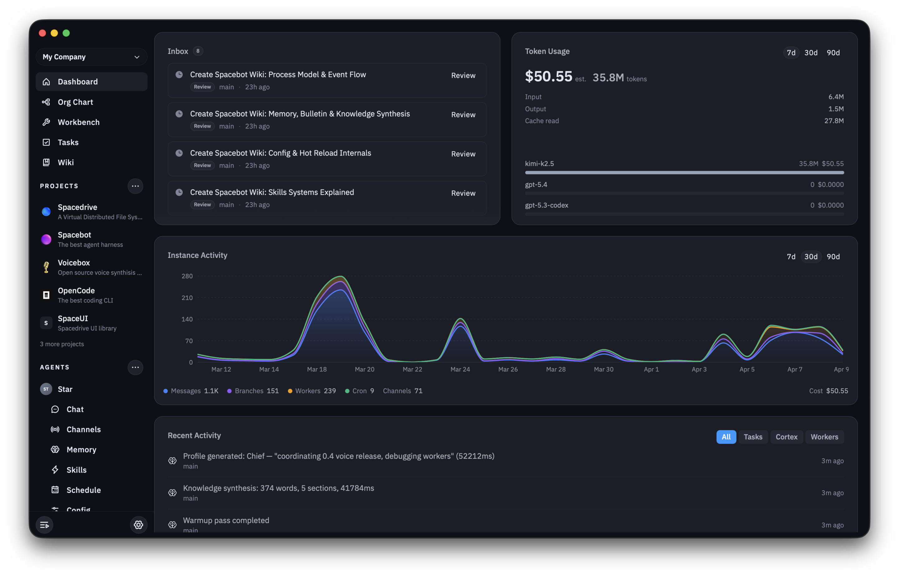

<p align="center">
  
</p>

<h1 align="center">Spacebot</h1>

<p align="center">
  <strong>The agent harness that runs teams, communities, and companies.</strong>
</p>

<p align="center">
  <a href="https://fsl.software/">
    
  </a>
  <a href="https://github.com/spacedriveapp/spacebot">
    
  </a>
  <a href="https://discord.gg/gTaF2Z44f5">
    
  </a>

  <a href="https://deepwiki.com/spacedriveapp/spacebot">
    
  </a>
</p>

<p align="center">
  <a href="https://spacebot.sh"><strong>spacebot.sh</strong></a> •
  <a href="#how-it-works">How It Works</a> •
  <a href="#the-task-board">Task Board</a> •
  <a href="#quick-start">Quick Start</a> •
  <a href="https://docs.spacebot.sh">Docs</a>
</p>

> **One-click deploy with [spacebot.sh](https://spacebot.sh)** — connect your Discord, Slack, Telegram, or Twitch, configure your agent, and go. No self-hosting required.

<p align="center">
  
</p>

---

Spacebot is opinionated agent infrastructure, built for teams and usable by anyone. **State belongs in structured storage, not markdown files the LLM manages.** Memory lives in a typed graph in SQLite. Autonomy runs on a task state machine linked to goals, not a heartbeat.json. The LLM reasons. The system holds state.

**It gets smarter the more you use it.** After complex tasks, the agent captures what it learned as reusable skills. After conversations go idle, a background process silently saves skills and memories worth keeping. Every session builds on the last — without any user action.

It works out of the box and scales from one person to a whole community.

---

## The Problem

Most AI agent frameworks run everything in a single session. One LLM thread handles conversation, thinking, tool execution, memory retrieval, and context compaction, all in one loop. When it's doing work, it can't talk to you. When it's compacting, it goes dark. When it retrieves memories, raw results pollute the context with noise.

Spacebot splits the monolith into specialized processes that only do one thing, and delegate everything else.

---

## Built for Teams

No other agent harness handles concurrent multi-user conversations, shared memory across channels, and true process-level concurrency. A Discord community with hundreds of active members, a Slack workspace running parallel workstreams, a Telegram group coordinating across time zones. Spacebot handles all of it without any user waiting on another.

Solo users get the same infrastructure. Better memory, better concurrency, better structure. Everything teams rely on, for one person.

**For communities:** drop Spacebot into a Discord server. It handles concurrent conversations across channels and threads, remembers context about every member, and does real work without going dark. Fifty people can interact simultaneously. A message coalescing system detects rapid-fire bursts, batches them into a single turn, and lets the agent read the room.

**For teams:** connect it to Slack. Each channel gets a dedicated conversation with shared memory. One engineer gets a deep coding session while another gets a quick answer. Workers handle heavy lifting in the background while the channel stays responsive.

**For multi-agent setups:** run multiple agents on one instance. A community bot on Discord, a dev assistant on Slack, a research agent handling background tasks. Each with its own identity, memory, and security permissions. One binary, one deploy.

---

## How It Works

Five process types. Each does one job.

**Channels** are the user-facing LLM process. One per conversation, with soul, identity, and personality. A channel never executes tasks or searches memories directly. It branches to think, spawns workers to act, and stays responsive.

**Branches** fork from the channel's context to think. They have the full conversation history and run concurrently. The channel sees the conclusion, not the working.

**Workers** are independent processes. Each gets a specific task, a focused prompt, and task-appropriate tools, with no conversation context. Fire-and-forget for one-shot tasks, or interactive for longer sessions where follow-up routes to the active worker.

**The Compactor** is a programmatic monitor (not an LLM) that watches context size per channel and triggers compaction before the channel fills up. Compaction workers run alongside without blocking.

**The Cortex** sees across all channels, workers, and branches simultaneously. It maintains the agent's working memory — a layered context assembly system that gives every conversation structured awareness of what's happening across the agent. Events are recorded as they happen; intra-day synthesis compresses them into narrative; daily summaries roll up at midnight; knowledge synthesis regenerates when the memory graph changes. The cortex supervises processes and maintains the memory graph.

```
User sends message
    → Channel receives it
        → Branches to think (has channel's context)
            → Branch recalls memories, decides what to do
            → Branch might spawn a worker for heavy tasks
            → Branch returns conclusion
        → Branch deleted
    → Channel responds to user

Channel context hits 80%
    → Compactor notices
        → Spins off a compaction worker
            → Worker summarizes old context
            → Compacted summary swaps in
    → Channel never interrupted
```

For process capabilities, tool access by type, memory internals, cron, and multi-agent isolation, see the [architecture guide](<docs/content/docs/(core)/architecture.mdx>).

---

## The Task Board

Spacebot is built around an instance-level task board. Every agent on the instance shares it, every task carries a globally unique number, and it is the substrate through which agents delegate work to each other.

A task moves through five states — `pending_approval` → `backlog` → `ready` → `in_progress` → `done` — at one of four priorities. Two agent IDs sit on every task: the **owner** (who created it) and the **assignee** (who executes it). Reassigning is how work changes hands.

**Agents delegate by creating tasks.** When one agent calls `send_agent_message` on another, that is not a chat message — it opens a task on the target agent's board, owned by the sender and assigned to the recipient, at `ready`. The board is the inter-agent protocol, and who may message whom is constrained by the communication graph.

**Pickup is autonomous.** The cortex runs a background loop that claims the highest-priority `ready` task assigned to its agent, flips it to `in_progress`, and hands it to a worker with full tool access. The claim is a conditional `UPDATE ... WHERE status = 'ready'`, so two agents racing the same task can't both win it. Progress notes go on the task itself, so after a crash the next pass reads task metadata and resumes.

**The agent proposes. You decide.** Tasks the cortex creates land in `pending_approval` and raise a dashboard notification. Nothing runs autonomously until you approve it.

Goals live in the memory graph as `Goal`-typed memories rather than as board rows — they set direction and get recalled into context, but they aren't scheduled or executed the way tasks are.

---

## What It Does

### Memory

Spacebot's memory is a typed, graph-connected knowledge system in SQLite and LanceDB. Every memory has a type, an importance score, and graph edges to related memories. The agent distinguishes facts from decisions, preferences from goals.

- **Eight memory types** — Fact, Preference, Decision, Identity, Event, Observation, Goal, Todo
- **Graph edges** — RelatedTo, Updates, Contradicts, CausedBy, PartOf
- **Hybrid recall** — vector similarity + full-text search merged via Reciprocal Rank Fusion
- **Memory import** — drop files into `ingest/` and Spacebot extracts structured memories automatically. Supports text, markdown, and PDF.
- **Working memory** — a five-layer context assembly system. Identity context, a structured event log, cross-channel activity map, participant awareness, and change-driven knowledge synthesis. Most layers are programmatic — no LLM calls to stay current

### Skills

Skills are reusable procedures injected into worker system prompts. The agent writes them from experience — and they accumulate automatically over time.

- **Autonomous skill capture** — when a channel identifies a workflow that required multiple steps or problem-solving, it delegates to a branch to write it as a skill. The skill loads into the next session and every session after
- **Post-conversation reflection** — after a conversation goes idle, a background branch silently reviews the history and saves skills and memories worth keeping. No user action required
- **AI-assisted authoring** — describe a skill in plain language, the agent generates it and shows a preview before saving
- **Worker injection** — skills are injected into worker system prompts for specialized tasks
- **skills.sh registry** — install any skill from the public ecosystem with one command. Compatible with any skill from the public registry

```bash
spacebot skill add vercel-labs/agent-skills
spacebot skill add anthropics/skills/pdf
spacebot skill list
```

### Scheduling

Cron jobs created and managed from conversation:

- **Natural scheduling** — "check my inbox every 30 minutes" becomes a cron job with a delivery target
- **Strict wall-clock schedules** — cron expressions for exact local-time execution
- **Single delivery** — all reply calls are buffered during the run and flushed as one message when the job completes. No mid-run fragments.
- **Circuit breaker** — auto-disables after 3 consecutive failures
- **Full agent capabilities** — each job gets a fresh channel with branching and workers

### Task Execution

Workers come loaded with tools for real work:

- **Shell** — run arbitrary commands with configurable timeouts
- **File** — read, write, and list files with auto-created directories
- **Browser** — headless Chrome automation with accessibility-tree refs. Navigate, click, type, screenshot, manage tabs
- **[OpenCode](https://opencode.ai)** — spawn a full coding agent as a persistent worker with codebase exploration, LSP awareness, and deep context management
- **[Brave](https://brave.com/search/api/) web search** — search the web with freshness filters, localization, and configurable result count

### Projects and Repos

Projects are how agents get pointed at real codebases. A project is a root directory registered once at the instance level and usable by every agent — no re-registering the same repo per agent.

- **Multi-repo by design** — one project holds many git repos, each tracked with its remote URL, default branch, current branch, and disk usage
- **Worktrees** — git worktrees are first-class rows linked to their repo, so parallel branch work gets its own directory instead of fighting over one checkout
- **Worker targeting** — `spawn_worker` accepts a `project_id` or `worktree_id`; the worker's working directory and prompt context are set from it automatically
- **Sandbox integration** — registering a project refreshes the sandbox allowlist so workers can reach project paths outside the agent workspace

### Wiki

An instance-wide, permanently versioned knowledge base that sits alongside the memory graph. Memories are atomic facts that decay and get auto-injected into prompts; wiki pages are authored long-form documents that don't decay and are read on demand.

- **Versioned forever** — every edit writes a new version, nothing is destructive
- **Wiki-link navigation** — pages reference each other and resolve as a graph
- **Agent-writable** — `wiki_create`, `wiki_edit`, `wiki_read`, `wiki_search`, `wiki_list`, `wiki_history` are available to workers and branches
- **Shared** — one wiki per instance, across all agents and humans

### Multi-Agent and the Org Graph

Run many agents on one binary. Each gets its own soul, workspace, databases, cortex, conversations, and messaging bindings — fully isolated.

- **Communication graph** — explicit directed links define which agents may message which. Org-level humans are nodes too, so agents know who manages them
- **Agent factory** — agents create and configure other agents at runtime from presets, via `factory_*` tools
- **Per-agent permissions** — a `[permissions]` block per agent controls tool access and inter-agent data boundaries, checked at tool registration, at execution, and again on output. Denials return a structured error the LLM can reason about rather than a hidden tool or a silent failure

### Dashboard, Portal, and Desktop

- **Web dashboard** — React SPA embedded directly in the binary via `rust-embed`. Channels, workers, memories, tasks, cron, projects, wiki, cortex, skills, ingest, and settings
- **Notifications** — task approvals, worker failures, and cortex observations surface as actionable items pushed over SSE, each deep-linked to its source entity
- **Portal** — embeddable public chat with SSE streaming and per-agent session isolation
- **Desktop app** — Tauri 2 shell wrapping the same interface, with the `spacebot` binary bundled as a sidecar it can launch locally
- **Self-update** — checks GitHub releases and can update in place, including rewriting its own Docker image tag when `/var/run/docker.sock` is mounted

### Observability

- **Prometheus metrics** — LLM cost, token usage, agent activity, and memory operations, behind the `metrics` cargo feature so it compiles out entirely when unused
- **Token accounting** — per-call usage and cost estimates persisted to SQLite and surfaced in the dashboard
- **Worker transcripts** — every worker's turns and tool calls are recorded and replayable from the Workers tab
- **Loop guard** — programmatic detection of stuck tool loops (repeated identical calls, ping-pong patterns, global circuit breaker) with thresholds tuned per process type, so a spinning worker gets interrupted instead of burning budget

### Messaging

Native adapters for Discord, Slack, Telegram, Twitch, Signal, Mattermost, Email, and Webchat, plus a generic Webhook receiver:

- **Message coalescing** — rapid-fire messages are batched into a single LLM turn with timing context
- **File attachments** — send and receive files, images, and documents. Attachments are saved to the workspace and recalled by ID
- **Rich messages** — embeds/cards, interactive buttons, select menus, and polls (Discord). Block Kit and slash commands (Slack)
- **Email** — IMAP polling + SMTP delivery with TLS, UID-based dedup, allowed sender filtering, and attachment limits. Works with local bridges like Proton Bridge
- **Webchat** — embeddable portal chat with SSE streaming, per-agent session isolation
- **Per-channel permissions** — guild, channel, and DM-level access control, hot-reloadable

### Model Routing

Three-level routing picks the right model for every call, decided explicitly from the process type and task type — no keyword scoring, no classifier, no content analysis. Channels get the best conversational model. Workers, the compactor, and the cortex get something fast and cheap. Task-type overrides upgrade coding workers automatically. Per-model fallback chains retry on a different model when one fails, with rate-limit cooldown.

Any OpenAI-compatible or Anthropic-compatible endpoint works, including Ollama for local models, Z.ai GLM models, Azure OpenAI, and custom providers. Built-in support for Kilo Gateway, NVIDIA, MiniMax, Moonshot AI, Gemini, GitHub Copilot, OpenCode Go, and more.

### MCP Integration

Connect workers to external [MCP](https://modelcontextprotocol.io/) servers for arbitrary tool access — databases, APIs, SaaS products, custom integrations. Both stdio and streamable HTTP transports. Automatic tool discovery, hot-reloadable, exponential-backoff retry so a broken server never blocks startup.

### Security

Spacebot runs autonomous LLM processes that execute arbitrary shell commands. Security is layered so no single failure exposes credentials or breaks containment.

**Credential isolation:** secrets split into system credentials (LLM API keys, messaging tokens, never exposed to subprocesses) and tool credentials (CLI tokens injected as env vars into workers). Every subprocess starts with a sanitized environment. System secrets never enter any subprocess.

- **Secret store** — credentials live in a dedicated encrypted database, referenced by alias. Plain config files never contain secrets
- **Encryption at rest** — optional AES-256-GCM with a master key derived via Argon2id, stored in the OS credential store (macOS Keychain, Linux kernel keyring), never on disk or in an env var
- **Output scrubbing** — all tool secret values are redacted from worker output before it reaches channels or LLM context. A rolling buffer handles secrets split across stream chunks

**Process containment:** shell and exec tools run inside OS-level filesystem containment. On Linux, [bubblewrap](https://github.com/containers/bubblewrap) creates a mount namespace where the filesystem is read-only except the agent's workspace. On macOS, `sandbox-exec` enforces equivalent restrictions via SBPL profiles. Enforced at the kernel level.

- **Dynamic sandbox** — toggle sandbox mode via dashboard or API without restarting
- **Workspace isolation** — file tools reject paths outside the agent's workspace. Symlinks that escape are blocked.
- **Leak detection** — secret-pattern checks at channel egress across plaintext, URL-encoded, base64, and hex encodings
- **SSRF protection** — browser tool blocks requests to cloud metadata endpoints, private IPs, loopback, and link-local addresses

---

## Gets Better with Use

Spacebot builds on itself over time through four specific mechanisms.

**Branches write skills from experience.** When a channel identifies a workflow that required multiple steps, problem-solving, or domain knowledge, it delegates to a branch to capture it as a structured skill. The skill goes to disk and loads into the next session. Future workers get it injected into their system prompt.

**Post-conversation reflection saves what's worth keeping.** After a conversation goes idle, a background branch reviews the history and silently saves skills and memories worth keeping. It runs with a capped turn budget, produces no user-visible output, and fires only when there's enough conversation to learn from.

**Memory deepens with every interaction.** Each conversation adds facts, preferences, decisions, and observations to a typed graph with importance scoring and graph edges. The cortex synthesizes this into a briefing every future conversation benefits from.

**The board drives autonomous work between conversations.** The cortex's pickup loop claims ready tasks and runs them through workers without anyone asking. Working memory records what happened, so the next conversation picks up where things left off. Dormant-mode agents skip the loop entirely and run only when an external trigger wakes them.

Everything goes through typed tools into structured storage. Nothing drifts.

---

## Quick Start

### Prerequisites

- **Rust** 1.85+ ([rustup](https://rustup.rs/))
- **protoc** (protobuf compiler) — required by LanceDB's build scripts. `apt install protobuf-compiler`, `brew install protobuf`, or use the included nix flake
- An LLM API key from any supported provider (Anthropic, OpenAI, OpenRouter, Kilo Gateway, Z.ai, Groq, Together, Fireworks, DeepSeek, xAI, Mistral, NVIDIA, MiniMax, Moonshot AI, Gemini, GitHub Copilot, OpenCode Zen, OpenCode Go), or use `spacebot auth login` for Anthropic OAuth

### Build and Run

```bash
git clone https://github.com/spacedriveapp/spacebot
cd spacebot

# Optional: build the OpenCode embedded UI (requires Node 22+ and bun)
# Without this, OpenCode workers still work — the Workers tab shows a transcript view instead.
# ./scripts/build-opencode-embed.sh

cargo build --release
```

### Run

```bash
spacebot                      # start as background daemon
spacebot start --foreground   # or run in the foreground
spacebot stop                 # graceful shutdown
spacebot restart              # stop + start
spacebot status               # show pid and uptime
spacebot auth login           # authenticate via Anthropic OAuth
```

The binary creates all databases and directories automatically on first run. See the [quickstart guide](<docs/content/docs/(getting-started)/quickstart.mdx>) for more detail.

### Authentication

Spacebot supports Anthropic OAuth as an alternative to static API keys:

```bash
spacebot auth login             # OAuth via Claude Pro/Max (opens browser)
spacebot auth login --console   # OAuth via API Console
spacebot auth status            # show credential status and expiry
spacebot auth refresh           # manually refresh the access token
spacebot auth logout            # remove stored credentials
```

OAuth tokens are stored in `anthropic_oauth.json` and auto-refresh before each API call. When OAuth credentials are present, they take priority over a static `ANTHROPIC_API_KEY`.

---

## Deploy Your Way

| Method                                 | What You Get                                                                                |
| -------------------------------------- | ------------------------------------------------------------------------------------------- |
| **[spacebot.sh](https://spacebot.sh)** | One-click hosted deploy. Connect your platforms, configure your agent, done.                |
| **Self-hosted**                        | Single Rust binary. No Docker, no server dependencies, no microservices. Clone, build, run. |
| **Docker**                             | Container image with everything included. Mount a volume for persistent data.               |

---

## Tech Stack

| Layer           | Technology                                                                                                      |
| --------------- | --------------------------------------------------------------------------------------------------------------- |
| Language        | **Rust** (edition 2024) — single binary, no runtime dependencies, no GC pauses                                  |
| Async runtime   | **Tokio**                                                                                                       |
| LLM framework   | **[Rig](https://github.com/0xPlaygrounds/rig)** v0.33 — agentic loop, tool execution, hooks                     |
| Relational data | **SQLite** (sqlx) — conversations, memory graph, tasks, goals, cron jobs                                        |
| Vector + FTS    | **[LanceDB](https://lancedb.github.io/lancedb/)** — embeddings (HNSW), full-text (Tantivy), hybrid search (RRF) |
| Key-value       | **[redb](https://github.com/cberner/redb)** — settings, encrypted secrets                                       |
| Embeddings      | **FastEmbed** — local embedding generation                                                                      |
| Crypto          | **AES-256-GCM** — secret encryption at rest                                                                     |
| Discord         | **Serenity** — gateway, cache, events, rich messages, interactions                                              |
| Slack           | **slack-morphism** — Socket Mode, events, Block Kit, slash commands                                             |
| Telegram        | **teloxide** — long-poll, media attachments, group/DM support                                                   |
| Twitch          | **twitch-irc** — chat integration with trigger prefix                                                           |
| Browser         | **Chromiumoxide** — headless Chrome via CDP                                                                     |
| HTTP API        | **axum** + **utoipa** — control API with a generated OpenAPI spec                                              |
| Dashboard       | **React** + **Vite**, embedded into the binary via **rust-embed**                                              |
| Desktop         | **Tauri 2** — native shell with the server bundled as a sidecar                                                |
| CLI             | **Clap** — command line interface                                                                               |

Single binary, no server dependencies. All data lives in embedded databases in a local directory.

---

## Documentation

| Doc                                                                 | Description                                               |
| ------------------------------------------------------------------- | --------------------------------------------------------- |
| [Quick Start](<docs/content/docs/(getting-started)/quickstart.mdx>) | Setup, config, first run                                  |
| [Config Reference](<docs/content/docs/(configuration)/config.mdx>)  | Full `config.toml` reference                              |
| [Architecture](<docs/content/docs/(core)/architecture.mdx>)         | Process types, tool access, memory internals, multi-agent |
| [Memory](<docs/content/docs/(core)/memory.mdx>)                     | Memory system design                                      |
| [Tools](<docs/content/docs/(features)/tools.mdx>)                   | All available LLM tools                                   |
| [Routing](<docs/content/docs/(core)/routing.mdx>)                   | Model routing and fallback chains                         |
| [Secrets](<docs/content/docs/(configuration)/secrets.mdx>)          | Credential storage, encryption, output scrubbing          |
| [Sandbox](<docs/content/docs/(configuration)/sandbox.mdx>)          | Process containment and environment sanitization          |
| [Cron Jobs](<docs/content/docs/(features)/cron.mdx>)                | Scheduled recurring tasks                                 |
| [OpenCode](<docs/content/docs/(features)/opencode.mdx>)             | OpenCode as a worker backend                              |
| [Messaging](<docs/content/docs/(messaging)/messaging.mdx>)          | Adapter architecture and platform setup                   |
| [Agents](<docs/content/docs/(core)/agents.mdx>)                     | Multi-agent setup, isolation, and the communication graph |
| [Tasks](<docs/content/docs/(features)/tasks.mdx>)                   | The instance-level task board and autonomous pickup       |
| [Workers](<docs/content/docs/(features)/workers.mdx>)               | Worker lifecycle, segments, timeouts, and transcripts     |
| [Projects](<docs/content/docs/(features)/projects.mdx>)             | Repos, worktrees, and pointing workers at codebases       |
| [Wiki](<docs/content/docs/(features)/wiki.mdx>)                     | Versioned instance-wide knowledge base                    |
| [Permissions](<docs/content/docs/(configuration)/permissions.mdx>)  | Per-agent tool access and inter-agent boundaries          |
| [Cortex](<docs/content/docs/(core)/cortex.mdx>)                     | The system observer and working-memory assembly           |
| [Compaction](<docs/content/docs/(core)/compaction.mdx>)             | How context stays under the window                        |
| [Prompts](<docs/content/docs/(core)/prompts.mdx>)                   | Prompt templates and per-agent overrides                  |
| [Browser](<docs/content/docs/(features)/browser.mdx>)               | Headless Chrome automation                                |
| [Ingestion](<docs/content/docs/(features)/ingestion.mdx>)           | Bulk file import into the memory graph                    |
| [Portal](<docs/content/docs/(features)/portal.mdx>)                 | Embeddable public chat                                    |
| [Notifications](<docs/content/docs/(features)/notifications.mdx>)   | Actionable events and SSE delivery                        |
| [Skills](<docs/content/docs/(features)/skills.mdx>)                 | Authoring, capture, and the skills.sh registry            |
| [Desktop](<docs/content/docs/(getting-started)/desktop.mdx>)        | Tauri desktop app and the sidecar binary                  |
| [Docker](<docs/content/docs/(getting-started)/docker.mdx>)          | Container deployment and updates                          |
| [Metrics](<docs/content/docs/(deployment)/metrics.mdx>)             | Prometheus metrics behind the `metrics` feature           |

---

## Contributing

Contributions welcome. Read [RUST_STYLE_GUIDE.md](RUST_STYLE_GUIDE.md) before writing any code, and [AGENTS.md](AGENTS.md) for the full implementation guide.

1. Fork the repo
2. Create a feature branch
3. Install `just` (https://github.com/casey/just) if it is not already available (for example: `brew install just` or `cargo install just --locked`)
4. Run `./scripts/install-git-hooks.sh` once (installs pre-commit formatting hook)
5. Make your changes
6. Run `just preflight` and `just gate-pr`
7. Submit a PR

### SpaceUI (Frontend Components)

The dashboard uses [`@spacedrive/*`](https://github.com/spacedriveapp/spaceui) packages from npm. For local development with linked packages, see [CONTRIBUTING.md](CONTRIBUTING.md).

Formatting is still enforced in CI, but the hook catches it earlier by running `cargo fmt --all` before each commit. `just gate-pr` mirrors the CI gate and includes migration safety, compile checks, and test verification.

---

## License

FSL-1.1-ALv2, [Functional Source License](https://fsl.software/), converting to Apache 2.0 after two years. See [LICENSE](LICENSE) for details.
