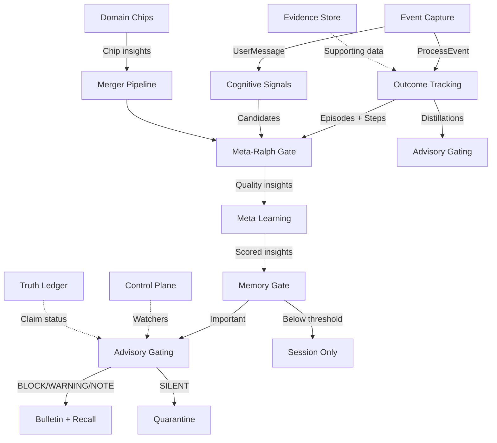

# Evolving Intelligence — Milestone 4: Polish (Introspection, Metrics & Observatory)

Make the learning system visible, measurable, and debuggable. After this milestone, the user can see what the system has learned, measure its effectiveness, browse an Obsidian vault of the entire intelligence pipeline, and manually intervene when needed.

## Overview

The learning system is powerful but opaque without introspection. This milestone adds three visibility layers:
1. **`/learned` command** — Quick chat-based view of learning state
2. **Web dashboard** — Full API + frontend for browsing, charting, and intervening
3. **Obsidian Observatory** — Generated markdown vault for deep exploration
4. **Metrics system** — Compounding Rate (north star) + system health metrics
5. **Memory maintenance reconciliation** — Activate the dead code in `maintenance.rs`

**Deliverable:** The user can type `/learned` to see a summary, open a web dashboard to explore learning data in detail, browse an Obsidian vault of the full pipeline, see the Compounding Rate trending toward 40%, and manually correct bad learnings.

## Proposed Solution

### Phase 6: `/learned` Chat Command

#### 6A: Command Handler

Register `/learned` as a recognized command in the channel message handler.

**Sub-commands (SpecFlow Gap Q12):**

| Command | Shows |
|---------|-------|
| `/learned` | Summary overview (default) |
| `/learned distillations` | Active distillations by type with reliability |
| `/learned episodes` | Recent episodes with prediction vs outcome |
| `/learned insights` | Meta-learning insights by category |
| `/learned chips` | Domain chip status and observation counts |
| `/learned metrics` | Compounding Rate + key health metrics |
| `/learned contradictions` | Recent contradictions and resolutions |

**Default `/learned` output (summary):**

```
Learning Status (42 episodes, 18 distillations, 31 insights)

Compounding Rate: 34% (target: 40%)
Ralph Pass Rate: 47%
Advisory Precision: 62%

Top Distillations:
  Policy: "Never force-push to main" (conf: 0.89)
  Sharp Edge: "Deploys after 5pm fail 40%" (conf: 0.72)
  Heuristic: "File search before grep" (conf: 0.68)

Active Chips: coding (142 obs), research (38 obs), productivity (67 obs)

Recent: 2 contradictions detected, 5 insights promoted this session
```

**Platform-aware formatting (SpecFlow Gap 7.1):**
- Discord: Max 2000 chars. Summary only in default. Sub-commands for detail.
- Slack: Blocks formatting with sections.
- Telegram: Markdown formatting, paginated if > 4096 chars.
- Web: Full output, no limits.

**Implementation:**
- Add a `LearningCommand` variant to the command parser
- Handler queries learning.db via `LearningStore` methods
- Format output per platform
- Return as a system message (not through the LLM)

### Phase 7: Web Dashboard API

#### 7A: API Endpoints

Extend the existing API server (`src/api/server.rs`) with learning endpoints.

**Read endpoints:**

| Endpoint | Returns |
|----------|---------|
| `GET /api/learning/distillations` | All distillations with reliability, usage stats. Query: `?type=policy&min_confidence=0.5` |
| `GET /api/learning/episodes` | Episodes with predictions vs outcomes. Query: `?status=completed&limit=50` |
| `GET /api/learning/episodes/:id/steps` | Step envelopes for an episode |
| `GET /api/learning/insights` | Insights by category. Query: `?category=user_model&min_reliability=0.7` |
| `GET /api/learning/chips` | Chip status, observation counts, success rates |
| `GET /api/learning/chips/:id/insights` | Insights from a specific chip |
| `GET /api/learning/bulletin` | Current bulletin with scoring breakdown |
| `GET /api/learning/quarantine` | Dropped advisories with human-readable reasons |
| `GET /api/learning/metrics` | All metrics: compounding rate, reuse rate, precision, Ralph pass rate |
| `GET /api/learning/metrics/history` | Time-series metric data. Query: `?metric=compounding_rate&days=30` |
| `GET /api/learning/contradictions` | Recent contradictions and resolutions |
| `GET /api/learning/evidence` | Evidence store by type. Query: `?type=error_trace&episode_id=...` |
| `GET /api/learning/truth` | Truth ledger entries. Query: `?status=fact&evidence_level=strong` |
| `GET /api/learning/tuneables` | Current tuneable values |
| `GET /api/learning/tuneables/history` | Auto-tuner adjustment history |

**Write endpoints (SpecFlow Gap 7.3 — manual intervention):**

| Endpoint | Action |
|----------|--------|
| `POST /api/learning/insights/:id/dismiss` | Soft-delete insight. Marks as dismissed, removes from advisory pool. Learning store retains for audit. |
| `PUT /api/learning/insights/:id/correct` | Update insight content. Resets reliability to 0.5, clears validation count. Treated as a new learning. |
| `POST /api/learning/insights/:id/promote` | Force-promote to memory graph (bypasses Meta-Ralph but not Memory Gate). |
| `POST /api/learning/distillations/:id/dismiss` | Soft-delete distillation. |
| `PUT /api/learning/distillations/:id/correct` | Update distillation text. Resets confidence. |
| `PUT /api/learning/tuneables/:key` | Manually override a tuneable value. |

**Implementation pattern:**
- Create `src/api/learning.rs` with handler functions
- Add `mod learning;` to `src/api.rs`
- Add routes in `src/api/server.rs`
- Access `LearningStore` through `ApiState` (add field)
- Follow existing authentication middleware

**Real-time updates (SpecFlow Gap 7.2):**
Multiplex learning events onto the existing SSE stream at `GET /api/events`:

```rust
// New SSE event types
ProcessEvent::LearningInsightCreated { ... },
ProcessEvent::LearningEpisodeCompleted { ... },
ProcessEvent::LearningDistillationCreated { ... },
ProcessEvent::LearningMetricUpdated { ... },
```

The frontend subscribes to the existing SSE endpoint and filters for learning events.

#### 7B: Frontend Dashboard

Extend the existing Vite frontend with a learning dashboard page.

**Key views:**
- **Overview:** Compounding Rate chart (line graph over time), key metrics cards, recent activity feed
- **Distillations:** Table with type, statement, confidence, usage stats. Sortable/filterable. Edit/dismiss actions.
- **Episodes:** Timeline view with prediction vs outcome. Click to expand step envelopes.
- **Insights:** Grouped by category. Reliability bars. Promote/dismiss/correct actions.
- **Chips:** Card per chip with status, observation count, success rate, recent insights.
- **Advisory:** Emission rate chart, quarantine log with human-readable reasons, effectiveness scores.
- **Truth Ledger:** Claims → Facts → Rules pipeline visualization.
- **Tuneables:** Current values with edit capability. Auto-tuner history.

**Quarantine human-readable reasons (SpecFlow Gap 7.4):**

Map internal reasons to user-friendly text:
| Internal | Human-readable |
|----------|---------------|
| `per_tool_10s` | "Same tool advice was shown recently (10s cooldown)" |
| `per_advice_600s` | "This specific advice was shown in the last 10 minutes" |
| `agreement_single_source` | "Only one source supports this — needs corroboration for WARNING level" |
| `budget_exceeded` | "Already showed 2 items this turn (emission budget)" |
| `context_obvious` | "You just did this action — no need to remind" |

### Phase 8: Obsidian Observatory

#### 8A: Observatory Generator

A Rust function (or CLI subcommand) that reads learning.db and generates Obsidian-compatible markdown.

**Generated structure:**

```
{vault_dir}/
  _observatory/
    flow.md                  — Pipeline dashboard with Mermaid diagram
    flow.canvas              — JSON canvas for Obsidian spatial view
    stages/
      outcome-tracking.md    — Layer 1 health: episodes, predictions, distillations
      meta-learning.md       — Layer 2 health: insights, Ralph pass rate, contradictions
      advisory-gating.md     — Layer 3 health: emission rate, effectiveness, quarantine
      domain-chips.md        — Layer 4 health: per-chip status, observations
      control-plane.md       — Watcher firings, blocks, forces
      evidence-store.md      — Evidence by type, retention, cleanup stats
      truth-ledger.md        — Claims/facts/rules pipeline
      phase-machine.md       — Current phase, transition history
      memory-gate.md         — Persistence decisions, threshold stats
      metrics.md             — All metrics with trends
      tuneables.md           — Current config values
      escape-protocol.md     — Recent escalations and artifacts
  explore/
    cognitive-insights/      — One .md per insight
    distillations/           — One .md per distillation
    episodes/                — One .md per episode (with step envelopes)
    ralph-verdicts/          — One .md per verdict
    advisory-decisions.md    — Index table
    implicit-feedback.md     — Index table
    tuning-history.md        — Index table
  Dashboard.md               — Dataview queries
  .obsidian/
    plugins/
      dataview/              — Pre-installed Dataview plugin config
    workspace.json           — Default workspace layout
    graph.json               — Graph view color config
```

**Individual page format (example: cognitive insight):**

```markdown
---
type: cognitive-insight
category: reasoning
reliability: 0.82
confidence: 0.71
quality_score: 8
promoted: true
created: 2026-02-20
---

# File search before grep reduces false starts

**Category:** Reasoning
**Reliability:** 0.82 | **Confidence:** 0.71
**Quality Score:** 8/12 (Meta-Ralph: QUALITY)
**Status:** Promoted → Observation (memory ID: abc123)

## Evidence
- Episode ep-001: Used grep first, 3 false starts → switched to search, found in 1 try
- Episode ep-015: Confirmed pattern, no false starts with search-first

## Validations
- 4 validations, 0 contradictions
- Last validated: 2026-02-21

## Advisory Readiness
- Score: 0.68
- Emitted 3 times, helpful 2 times
```

**Pipeline Mermaid diagram in `flow.md`:**

```markdown
## Pipeline Flow



```

#### 8B: Auto-Sync

Background task on the Cortex timer (configurable, default 120s):

```rust
pub async fn sync_observatory(
    store: &LearningStore,
    config: &ObservatoryConfig,
) -> anyhow::Result<()> {
    if !config.enabled { return Ok(()); }

    let vault_dir = &config.vault_dir;
    // Generate all pages
    generate_flow_dashboard(store, vault_dir).await?;
    generate_stage_pages(store, vault_dir).await?;
    generate_explorer_pages(store, vault_dir, config).await?;
    generate_dashboard_queries(vault_dir)?;

    if config.generate_canvas {
        generate_canvas(vault_dir)?;
    }

    Ok(())
}
```

**Config:**

```rust
pub struct ObservatoryConfig {
    pub enabled: bool,
    pub auto_sync: bool,
    pub sync_cooldown_secs: u64,
    pub vault_dir: PathBuf,
    pub generate_canvas: bool,
    pub max_recent_items: usize,
    pub explore_max_per_type: usize,  // default 200
}
```

Added to `LearningConfig` as a nested struct. TOML:

```toml
[defaults.learning.observatory]
enabled = false  # opt-in
auto_sync = true
sync_cooldown_secs = 120
vault_dir = "~/Documents/Obsidian Vault/Spacebot-Observatory"
generate_canvas = true
max_recent_items = 20
explore_max_per_type = 200
```

#### 8C: CLI Subcommand

Also available as a manual command:

```bash
spacebot observatory generate --force --verbose
spacebot observatory status
```

### Phase 9: Metrics System

#### 9A: Compounding Rate (North Star)

```
Compounding Rate = (Episodes where reused memory led to success) / (Total completed episodes)
```

**Attribution mechanism (SpecFlow Gap 7.5):**

An episode counts as "reused memory led to success" when ALL of:
1. At least one distillation or promoted insight was retrieved during the episode (logged by structural retriever)
2. The retrieved learning was surfaced (emitted at NOTE+ or included in bulletin)
3. The episode completed successfully (`success: true`)
4. The surfaced learning was trace-linked to the episode (via `implicit_feedback` with matching `episode_id`)

This is conservative — bulletin-only memories (not trace-linked) do NOT count toward compounding rate. This ensures the metric measures genuine reuse, not coincidence.

**Target:** 40%

#### 9B: Additional Metrics

| Metric | Formula | Target |
|--------|---------|--------|
| Reuse Rate | Retrieved learnings / Total stored | > 20% |
| Memory Effectiveness | Helpful retrievals / Total retrievals | > 50% |
| Loop Suppression | Episodes avoiding past mistakes / Episodes facing similar situations | > 60% |
| Distillation Quality | Successful distillation uses / Total uses (by type) | > 70% |
| Advisory Precision | Helpful emissions / Total emissions | > 50% |
| Ralph Pass Rate | QUALITY verdicts / Total verdicts | 20-60% |
| Emission Rate | Events with advice / Total events | 5-15% |
| Evidence Coverage | Episodes with evidence / Total episodes | > 80% |

#### 9C: Metric Recording

Store time-series in the existing `metrics` table (created in Milestone 1).

**Recording triggers:**
- Compounding Rate: calculated on each episode completion
- Advisory Precision: on each feedback signal (helpful/unhelpful/noisy)
- Ralph Pass Rate: on each verdict
- Others: on hourly timer

**Metric aggregation for dashboard:**
- Rolling 7-day average for trend charts
- Per-session breakdown for detailed view
- All-time aggregate for headline numbers

### Phase 10: Memory Maintenance Reconciliation

#### 10A: Activate maintenance.rs

The existing `src/memory/maintenance.rs` has `run_maintenance()` that applies decay, prunes, and merges — but it's **never called**.

**Wire it up:**
1. Call `run_maintenance()` from the Cortex timer cycle (same as bulletin interval, or separate configurable interval)
2. Replace flat `decay_rate: 0.05` with category-specific half-lives:

| Category | Half-life | Daily decay rate |
|----------|-----------|-----------------|
| Identity | Never | 0.0 |
| User Model / Preference | Never | 0.0 |
| Wisdom | Never | 0.0 |
| Relationship | Never | 0.0 |
| Self-Awareness | 90 days | 0.0077 |
| Domain Expertise | 90 days | 0.0077 |
| Communication | 60 days | 0.0116 |
| Reasoning | 60 days | 0.0116 |
| Context | 45 days | 0.0154 |
| Event | 30 days | 0.0231 |

Formula: `daily_rate = 1 - 2^(-1/half_life_days)`

3. **Extend maintenance with distillation pruning:**
   - Prune distillations with `success_ratio < 0.15` after 10+ uses
   - Collapse near-duplicate distillations
   - Remove expired evidence from evidence store

4. **Return unified `MaintenanceReport`** that includes memory graph + learning store actions.

#### 10B: Reconcile Decay Models (SpecFlow Gap 8.4)

Replace the current flat `decay_rate` with the category-aware model. The maintenance config gains a `category_decay_rates: HashMap<String, f64>` field. The existing `apply_decay()` function checks memory type and applies the appropriate rate.

**Key:** Memories promoted from the learning system carry their category in the `source` field (e.g., `learning:reasoning`). Non-learning memories use a default decay rate based on MemoryType.

## Acceptance Criteria

### Functional Requirements

- [x] `/learned` command returns summary in chat
- [x] `/learned` sub-commands work: distillations, episodes, insights, chips, metrics, contradictions
- [x] Platform-aware formatting (Discord 2000 char limit, Slack blocks, Telegram markdown)
- [x] All GET API endpoints return correct data with filtering and pagination
- [x] All write API endpoints work: dismiss, correct, promote insights/distillations
- [x] Manual tuneable override via API works
- [x] SSE stream includes learning events for real-time dashboard updates
- [x] Frontend dashboard renders: overview, distillations, episodes, insights, chips, advisory, truth, tuneables
- [x] Quarantine view shows human-readable reasons
- [x] Observatory generates correct markdown structure from learning.db
- [x] Observatory auto-sync runs on configurable interval when enabled
- [x] Observatory Mermaid diagram renders in Obsidian
- [x] Observatory explorer pages have correct YAML frontmatter for Dataview
- [x] Observatory respects max-per-type limits
- [x] CLI `observatory generate` subcommand works
- [x] Compounding Rate metric calculated correctly with conservative attribution
- [x] All 8 additional metrics tracked and recorded
- [x] Metric time-series stored for trend charts
- [x] `maintenance.rs` activated and called on timer
- [x] Category-specific decay rates applied correctly
- [x] Distillation pruning runs during maintenance
- [x] Evidence cleanup runs during maintenance
- [x] Unified `MaintenanceReport` includes all actions
- [x] `cargo clippy` and `cargo test` pass

### Quality Gates

- [x] `/learned` response renders correctly on Discord (< 2000 chars for summary)
- [x] API response times < 200ms for all GET endpoints
- [x] Observatory generation < 5 seconds for 500 items
- [x] Compounding Rate calculation matches manual verification on test data

## Technical Considerations

### Frontend build

The Vite frontend is built via `build.rs`. New dashboard pages need to be added to the frontend source (`frontend/` directory). Follow existing patterns for routing and component structure.

### Observatory file I/O

Generating 200+ markdown files every 120 seconds could be I/O heavy. Optimizations:
- Only regenerate changed files (hash comparison)
- Batch writes using `tokio::fs::write` with join_all
- Skip explorer pages that haven't changed (compare record timestamps)

### Maintenance timer coordination

Memory maintenance and learning maintenance should run on the same timer to avoid double-processing. Single `run_all_maintenance()` function that:
1. Runs memory graph maintenance (decay, prune, merge)
2. Runs learning store maintenance (distillation prune, evidence cleanup)
3. Returns combined report

### Compounding Rate accuracy

The conservative attribution mechanism (trace-linked + success + surfaced) may undercount true compounding. This is intentional — better to undercount than overcount. As the system matures and more advice is trace-linked (via implicit feedback), the metric naturally becomes more accurate.

## Dependencies & Risks

- **Depends on Milestone 3** (all learning data must exist to display/measure)
- **Frontend changes** require familiarity with the existing Vite setup
- **Obsidian compatibility:** Generated markdown must render correctly in Obsidian. Dataview queries must use correct syntax. Test with actual Obsidian installation.
- **Maintenance activation** is the riskiest change — it modifies existing memory behavior that has been inert until now. Test thoroughly with backup.

## References

### Internal References
- Brainstorm User Introspection: `docs/brainstorms/2026-02-22-evolving-intelligence-system-brainstorm.md:822-893`
- Brainstorm Observatory: `docs/brainstorms/2026-02-22-evolving-intelligence-system-brainstorm.md:853-893`
- Brainstorm Metrics: `docs/brainstorms/2026-02-22-evolving-intelligence-system-brainstorm.md:715-729`
- Brainstorm Reconciliation: `docs/brainstorms/2026-02-22-evolving-intelligence-system-brainstorm.md:897-906`
- Existing API server: `src/api/server.rs`
- Existing SSE endpoint: `src/api/server.rs` (events route)
- Memory maintenance: `src/memory/maintenance.rs`
- Frontend build: `build.rs`
- Spark Observatory reference: `docs/brainstorms/` (user-provided description)

### New Files (this milestone)
```
src/learning/
  commands.rs         — /learned command handler + sub-commands
  observatory.rs      — Observatory markdown generator + auto-sync
src/api/
  learning.rs         — All /api/learning/* endpoint handlers
frontend/
  src/pages/
    Learning.tsx       — Dashboard page component
  src/components/
    learning/          — Dashboard sub-components
```

### External References
- Obsidian Dataview plugin: https://blacksmithgu.github.io/obsidian-dataview/
- Obsidian Canvas format: https://obsidian.md/canvas
- Mermaid diagram syntax: https://mermaid.js.org/
